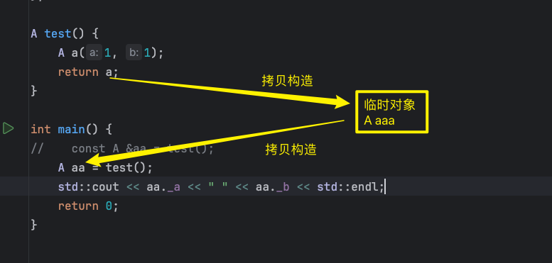

##### 传值返回会产生临时对象

###### 调用两次拷贝构造

>   CMake 禁用编译器优化选项
>
>   ```
>   cmake_minimum_required(VERSION 3.27)
>   project(cpp_learning)
>   
>   set(CMAKE_CXX_STANDARD 11)
>   add_compile_options(-fno-elide-constructors)
>   
>   set(CMAKE_CXX_FLAGS "${CMAKE_CXX_FLAGS} -O0")
>   set(CMAKE_C_FLAGS "${CMAKE_C_FLAGS} -O0")
>   
>   add_executable(cpp_learning main.cpp
>           func.c)
>   
>   ```

```c++
#include <iostream>
class A {
public:
    A(int a, int b) : _a(a), _b(b) {
        std::cout << "构造..." << std::endl;
    }

    ~A() {}

    A(const A &a)
            : _a(a._a), _b(a._b) {
        std::cout << "拷贝构造..." << std::endl;
    }

    int _a;
    int _b;
};

A test() {
    A a(1, 1);
    return a;
}

int main() {
//    const A &aa = test();
    A aa = test();
    std::cout << aa._a << " " << aa._b << std::endl;
    return 0;
}

```

```
构造...
拷贝构造...
拷贝构造...
1 1
```

传值返回会产生临时对象, 并且需要调用两次拷贝构造



###### 临时对象具有常性

如果使用引用接收, 那么必须是`const`引用才行

```c++
A test() {
    A a(1, 1);
    return a;
}

int main() {
    A &aa = test();
//    A aa = test();
//    std::cout << aa._a << " " << aa._b << std::endl;
    return 0;
}
```

```
/Users/zhuan/CLionProjects/cpp_learning/main.cpp:25:8: error: non-const lvalue reference to type 'A' cannot bind to a temporary of type 'A'
    A &aa = test();
       ^    ~~~~~~
1 error generated.
```

```c++
const A &aa = test();	// 这样才对
```


